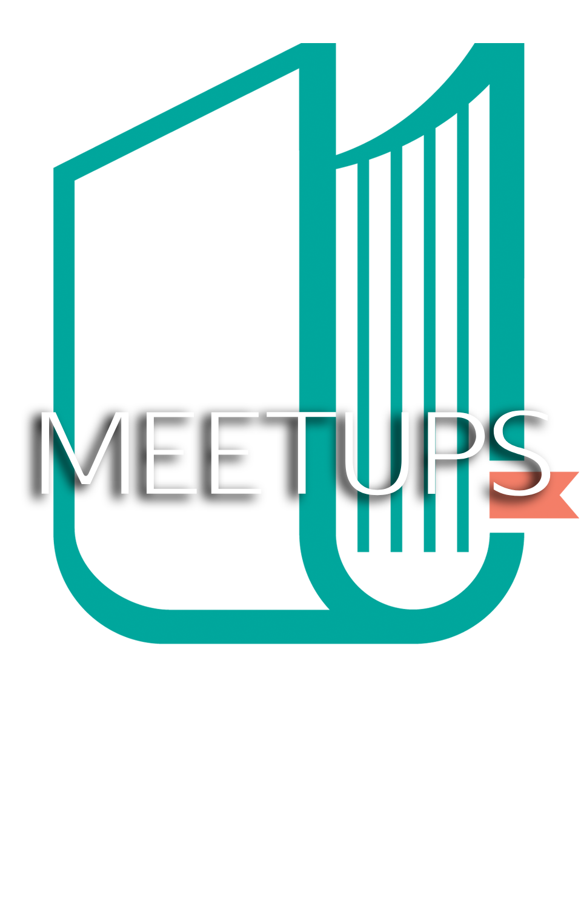

# 7gate academy alumni monthly meetup notes

Notes from the 7gate academy meetups! :book:
This is the _official_ :ok_hand: 7gate blockchain academy alumni + friends meetup group notes repo :smirk:

The group meet is held approximately once every 3 weeks and is an opportunity to discuss a new and interesting topic in world of blockchain technology. Open to academy alum and friends :raised_hands:

## Meetups (chronologically) 
 - May 5, 2019 [DAO's and decentralized governance](DAOs_may_5_2019.md) 
 - May 27, 2019 [Ethereum 2.0](Eth2.0_may_27_2019.md)
 - _TBD_  Tezos
